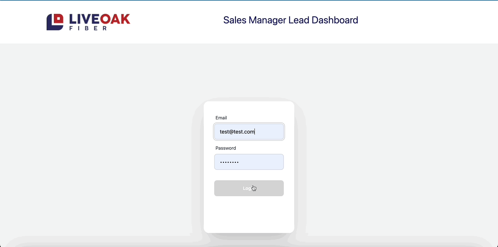

          
          
# Live Oak Fiber Leads Dashboard

## Description

Welcome to the Live Oak Fiber Lead Dashboard, a user-friendly tool designed for efficient lead management. This dashboard provides a centralized view of captured leads from a [custom form](https://live-oak-form.vercel.app/), displaying crucial information such as name, email, phone number, address, lead message, and creation date. Its intuitive interface ensures easy navigation. Once leads are assigned to sales reps, they are separated into another list displaying the lead information, the sales rep assigned, and the time they were assigned. The process is further streamlined with an automatically generated email prompt, enabling managers to add personalized comments before sending. 

*New Features*
The information collection form has been upgraded allowing each sales team member to have a unique URL. This upgrade enables lead data to be stored in sales reps individual Firestore Database collection. This allows team members to log in to the dashboard and easily follow up with their acquired leads."

## Quick Links

- [Installation](#installation)
  
- [Usage](#usage)

- [Technologies](#technologies)

- [Demo](#demo)
  
- [Contributors](#contributors)
  
- [Feedback and Support](#feedback-and-support)
  
- [License](#license)

## Installation

No install required for the web-based version. To run the application locally, clone the repository to your local machine

## Usage

To use the web-based version simply navigate to the deployed application [URL](https://lofmanagerdashboard.vercel.app/) and begin using the app in your browser.

## Technologies

          

## Demo

Follow me to the [Deployed Application](https://lofmanagerdashboard.vercel.app/)

## Contributors
Adam Brannon

[Check me out on Github](https://github.com/adam-brannon09)

[Email Me](mailto:adam.brannon09@icloud.com)

## Feedback and Support

If you encounter any issues while viewing the Live Oak Contact Request Form or have any suggestions for improvement, please [open an issue](https://github.com/adam-brannon09/lofmanagerdashboard/issues) on the GitHub repository. I appreciate your feedback and will address any concerns as soon as possible.

## License

Live Oak Contact Form is released under the [MIT License](https://opensource.org/licenses/MIT). You are free to use, modify, and distribute this application as per the terms of this license.

    

